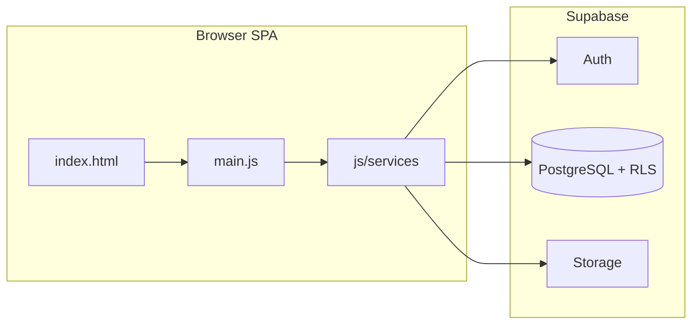
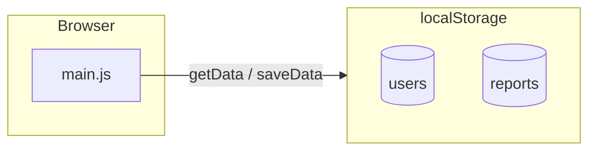

# System Overview — LostFinder (Capcap)

> **Note:** Sections marked *Legacy* describe the original localStorage prototype. For the **current Supabase system**, use:
> - [06-system-design.md](./06-system-design.md) — architecture, database, security
> - [07-system-flows.md](./07-system-flows.md) — user flows
> - [08-function-reference.md](./08-function-reference.md) — all functions
> - [09-recommendations.md](./09-recommendations.md) — design recommendations

## Project goal

LostFinder helps the ICCT Colleges Cainta campus **effectively handle and monitor lost and found items**. The app supports the full lifecycle:

1. **Report** — users submit lost or found items (with optional photo)
2. **Discover** — browse listings and see smart match suggestions
3. **Claim** — blind verification proves ownership without exposing finder answers
4. **Sighting** — community tips on lost items with owner verification and points
5. **Coordinate** — in-app messaging between users about specific items
6. **Resolve** — auto-approval, owner recovery, or admin closes the loop; points reward participation
7. **Govern** — admins review vague claims, manage items, view campus stats

## Current architecture (Supabase)



**Full design:** [06-system-design.md](./06-system-design.md)

| Layer | Technology |
|-------|------------|
| UI | HTML5, CSS3, responsive layout |
| Logic | Vanilla JavaScript ES modules (`main.js` ~2,200 lines) |
| Data access | `js/services/*.js` → Supabase client |
| Backend | Supabase Auth, PostgreSQL, Storage |
| Config | `.env` → `js/config.js` via `npm run config` |
| Dev server | live-server (port 8080) |

## Repository structure (current)

```
Capcap/
├── index.html              # All UI sections + modals
├── main.js                 # App logic and orchestration
├── main.css                # Styles
├── js/
│   ├── config.js           # Generated from .env
│   ├── constants.js        # Categories, points, badges
│   ├── services/           # Supabase data layer
│   ├── ui/init.js          # UI helpers
│   └── utils/              # escape, export
├── scripts/generate-config.mjs
└── docs/                   # Documentation + sql/
```

**Missing assets:** `main.css` references `icon/` images not in the repo.

## Feature map (current)

| Feature | Status | Doc |
|---------|--------|-----|
| Supabase Auth (email + username) | Done | [07-system-flows.md](./07-system-flows.md) §1 |
| Lost/found reports + photos | Done | §2 |
| Smart matching | Done | [06-system-design.md](./06-system-design.md) |
| Blind claims | Done | §5 |
| Sightings + owner verification | Done | §7–9 |
| Messaging | Done | §10 |
| Dashboard + JSON/CSV export | Done | §11 |
| Leaderboard + points | Done | §12 |
| Admin panel | Done | §14 |

## UI structure (`index.html`)

| Section | ID | Purpose |
|---------|-----|---------|
| Landing | `landing-page` | Marketing / get started |
| Login / Register | `login`, `register` | Auth forms |
| App shell | `app` | Sidebar + main content |
| Dashboard | `dashboard` | Stats, tips, matches, export |
| Lost / Found | `lost`, `found` | Browse listings |
| My reports | `reports` | User submissions + sightings |
| Messages | `messages` | Conversations + chat |
| Leaderboard | `leaderboard` | Points ranking |
| Settings | `settings` | Profile updates |
| Admin | `admin-panel`, `all-items`, `claims-panel` | Admin only (runtime) |

Modals: report, claim, sighting, recovery.

Navigation: `page(id)` in `main.js` — see [07-system-flows.md](./07-system-flows.md).

## Business rules (implemented)

| Rule | Implementation |
|------|----------------|
| Weekly report limit | 3 per user per 7 days (client + DB trigger) |
| Found-item verification | 3 blind questions → `simpleHash()` in `verify_hashes` |
| Auto-approve claims | All 3 answer hashes match |
| Manual review | Mismatch or vague answers (≤5 words) |
| Points | +5 lost, +10 found, +20 resolved, +10 helpful tip, +25 recovery tip |
| Match display | ≥50% shown; badges at ≥85% / ≥50% |
| Sighting verification | Owner marks helpful / recovered / dismissed |
| Image storage | Supabase Storage, 5 MB client check |

## Security posture (current — Supabase)

| Area | Status |
|------|--------|
| Password storage | Supabase Auth (bcrypt server-side) |
| Session | Supabase JWT; restored on page load |
| Authorization | RLS on all tables + `is_admin()` |
| Data integrity | PostgreSQL constraints + RLS |
| XSS | `escapeHtml` on rendered user content |
| Blind verification | Client-side hash only — see [09-recommendations.md](./09-recommendations.md) |

## Strengths

- Shared campus data via Supabase
- Smart matching with synonyms and fuzzy text
- Blind verification protects finder privacy
- Sighting tips with owner-verified points
- Gamification (points, leaderboard, badges)
- Complete feature set for campus pilot

## Remaining gaps

See [09-recommendations.md](./09-recommendations.md) for prioritized list. Highlights:

- No automated tests
- No Realtime messaging
- `main.js` still monolithic
- No deployment guide (beyond SETUP)
- Missing `icon/` assets

---

## Legacy: localStorage prototype

*The following sections describe the **original prototype** before Supabase migration. Kept for historical reference.*

### Architecture (legacy)



### Tech stack (legacy)

| Layer | Technology |
|-------|------------|
| Persistence | `localStorage` via `getData()` / `saveData()` |
| Auth | Client-side `btoa` passwords |
| Images | Base64 in reports |

### Security (legacy — critical issues)

| Area | Risk |
|------|------|
| Password storage | `btoa()` — trivially reversible |
| Admin account | Hardcoded, reset on load |
| Authorization | Client-side only — bypassable |

Migration completed per [04-migration-guide.md](./04-migration-guide.md) and [DEVELOPMENT-PHASES.md](./DEVELOPMENT-PHASES.md).

## Related documentation

| Doc | Purpose |
|-----|---------|
| [README.md](./README.md) | Documentation index |
| [SETUP.md](./SETUP.md) | Setup and troubleshooting |
| [03-supabase-integration-plan.md](./03-supabase-integration-plan.md) | Historical integration plan |
