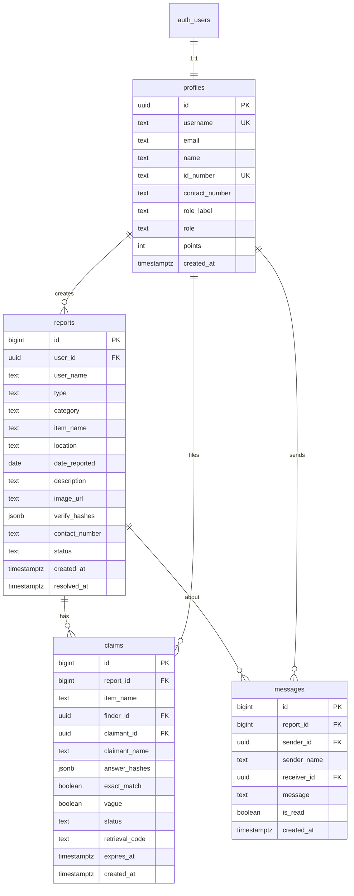

# Supabase Integration Plan

This document defines how to back LostFinder with **Supabase** (PostgreSQL, Auth, Storage, Realtime, and Row Level Security).

## Why Supabase fits this project

| LostFinder need | Supabase feature |
|-----------------|------------------|
| Shared campus data | PostgreSQL |
| User accounts | Supabase Auth (email/password) |
| Role-based admin | `profiles.role` + RLS |
| Item photos | Storage bucket `report-images` |
| Live messaging | Realtime on `messages` table |
| No custom server | Client SDK + RLS (Edge Functions optional later) |
| Free tier for campus pilot | Generous free tier for prototypes |

## High-level architecture

```mermaid
flowchart TB
    subgraph browser [LostFinder Client]
        UI[HTML/CSS/JS]
        SDK[@supabase/supabase-js]
    end

    subgraph supabase [Supabase Project]
        Auth[GoTrue Auth]
        PG[(PostgreSQL)]
        ST[Storage]
        RT[Realtime]
        RLS[Row Level Security]
    end

    UI --> SDK
    SDK --> Auth
    SDK --> PG
    SDK --> ST
    SDK --> RT
    PG --> RLS
```

## Environment configuration

Create a Supabase project at [supabase.com](https://supabase.com), then add:

```javascript
// js/config.js
export const SUPABASE_URL = 'https://YOUR_PROJECT.supabase.co';
export const SUPABASE_ANON_KEY = 'your-anon-key';
```

**Never commit the `service_role` key** to the frontend. Use it only in server-side scripts or Supabase SQL migrations.

For local development, optional `.env` (if using a bundler):

```
VITE_SUPABASE_URL=https://YOUR_PROJECT.supabase.co
VITE_SUPABASE_ANON_KEY=eyJ...
```

## Database schema

### Entity relationship



### SQL migration (run in Supabase SQL Editor)

```sql
-- =============================================
-- LostFinder / Capcap — Supabase Schema
-- =============================================

-- 1. Profiles (extends auth.users)
create table public.profiles (
  id uuid primary key references auth.users(id) on delete cascade,
  username text unique not null,
  email text unique not null,
  name text not null,
  id_number text unique,
  contact_number text default '',
  role_label text default 'Student',
  role text not null default 'user' check (role in ('user', 'admin')),
  points integer not null default 0,
  created_at timestamptz not null default now()
);

-- 2. Reports
create table public.reports (
  id bigint generated always as identity primary key,
  user_id uuid not null references public.profiles(id) on delete cascade,
  user_name text not null,
  type text not null check (type in ('lost', 'found')),
  category text not null default 'Other',
  item_name text not null,
  location text not null,
  date_reported date,
  description text not null,
  image_url text default '',
  verify_hashes jsonb,  -- { "q1": "H...", "q2": "H...", "q3": "H..." }
  contact_number text default '',
  status text not null default 'pending' check (status in ('pending', 'resolved')),
  created_at timestamptz not null default now(),
  resolved_at timestamptz
);

create index reports_type_status_idx on public.reports (type, status);
create index reports_user_id_idx on public.reports (user_id);
create index reports_created_at_idx on public.reports (created_at desc);

-- 3. Claims
create table public.claims (
  id bigint generated always as identity primary key,
  report_id bigint not null references public.reports(id) on delete cascade,
  item_name text not null,
  finder_id uuid not null references public.profiles(id),
  claimant_id uuid not null references public.profiles(id),
  claimant_name text not null,
  answer_hashes jsonb not null,
  exact_match boolean not null default false,
  vague boolean not null default false,
  status text not null default 'pending-review'
    check (status in ('auto-approved', 'pending-review', 'approved', 'denied')),
  retrieval_code text,
  expires_at timestamptz,
  created_at timestamptz not null default now()
);

create index claims_report_id_idx on public.claims (report_id);
create index claims_status_idx on public.claims (status);

-- 4. Messages
create table public.messages (
  id bigint generated always as identity primary key,
  report_id bigint not null references public.reports(id) on delete cascade,
  sender_id uuid not null references public.profiles(id),
  sender_name text not null,
  receiver_id uuid not null references public.profiles(id),
  message text not null,
  is_read boolean not null default false,
  created_at timestamptz not null default now()
);

create index messages_report_participants_idx
  on public.messages (report_id, sender_id, receiver_id);
create index messages_created_at_idx on public.messages (created_at desc);

-- 5. Auto-create profile on signup
create or replace function public.handle_new_user()
returns trigger
language plpgsql
security definer set search_path = public
as $$
begin
  insert into public.profiles (id, username, email, name, id_number, contact_number, role_label)
  values (
    new.id,
    coalesce(new.raw_user_meta_data->>'username', split_part(new.email, '@', 1)),
    new.email,
    coalesce(new.raw_user_meta_data->>'name', ''),
    new.raw_user_meta_data->>'id_number',
    coalesce(new.raw_user_meta_data->>'contact_number', ''),
    coalesce(new.raw_user_meta_data->>'role_label', 'Student')
  );
  return new;
end;
$$;

create trigger on_auth_user_created
  after insert on auth.users
  for each row execute function public.handle_new_user();

-- 6. Helper: check admin role
create or replace function public.is_admin()
returns boolean
language sql
stable
security definer set search_path = public
as $$
  select exists (
    select 1 from public.profiles
    where id = auth.uid() and role = 'admin'
  );
$$;

-- 7. Weekly report limit (optional DB enforcement)
create or replace function public.check_weekly_report_limit()
returns trigger
language plpgsql
as $$
declare
  report_count integer;
begin
  select count(*) into report_count
  from public.reports
  where user_id = new.user_id
    and created_at >= now() - interval '7 days';

  if report_count >= 3 then
    raise exception 'Weekly report limit reached (3 per week)';
  end if;
  return new;
end;
$$;

create trigger enforce_weekly_report_limit
  before insert on public.reports
  for each row execute function public.check_weekly_report_limit();
```

## Row Level Security (RLS)

Enable RLS on all tables and add policies:

```sql
alter table public.profiles enable row level security;
alter table public.reports enable row level security;
alter table public.claims enable row level security;
alter table public.messages enable row level security;

-- PROFILES
create policy "Public profiles are viewable by authenticated users"
  on public.profiles for select to authenticated using (true);

create policy "Users can update own profile"
  on public.profiles for update to authenticated
  using (auth.uid() = id) with check (auth.uid() = id);

create policy "Admins can update any profile"
  on public.profiles for update to authenticated
  using (public.is_admin());

-- REPORTS
create policy "Anyone authenticated can view pending reports"
  on public.reports for select to authenticated using (true);

create policy "Users can insert own reports"
  on public.reports for insert to authenticated
  with check (auth.uid() = user_id);

create policy "Users can update own reports"
  on public.reports for update to authenticated
  using (auth.uid() = user_id or public.is_admin());

create policy "Admins can delete reports"
  on public.reports for delete to authenticated
  using (public.is_admin());

-- CLAIMS
create policy "Participants and admins can view claims"
  on public.claims for select to authenticated
  using (
    auth.uid() = claimant_id
    or auth.uid() = finder_id
    or public.is_admin()
  );

create policy "Authenticated users can create claims"
  on public.claims for insert to authenticated
  with check (auth.uid() = claimant_id);

create policy "Admins can update claims"
  on public.claims for update to authenticated
  using (public.is_admin());

-- MESSAGES
create policy "Participants can view messages"
  on public.messages for select to authenticated
  using (auth.uid() = sender_id or auth.uid() = receiver_id);

create policy "Authenticated users can send messages"
  on public.messages for insert to authenticated
  with check (auth.uid() = sender_id);

create policy "Receiver can mark as read"
  on public.messages for update to authenticated
  using (auth.uid() = receiver_id);
```

## Storage

### Bucket setup

1. Create bucket: `report-images`
2. Set to **public** (for easy image URLs) or **private** with signed URLs
3. Policies:

```sql
-- Allow authenticated uploads to own folder
create policy "Users upload own images"
  on storage.objects for insert to authenticated
  with check (
    bucket_id = 'report-images'
    and (storage.foldername(name))[1] = auth.uid()::text
  );

create policy "Public read report images"
  on storage.objects for select to authenticated
  using (bucket_id = 'report-images');
```

### Upload path convention

```
report-images/{user_id}/{report_id}.{ext}
```

## Authentication mapping

| Current (`main.js`) | Supabase |
|---------------------|----------|
| `register()` | `supabase.auth.signUp({ email, password, options: { data: { username, name, id_number, ... } } })` |
| `login()` | `supabase.auth.signInWithPassword({ email, password })` |
| `logout()` | `supabase.auth.signOut()` |
| `currentUser` | `session.user` + `profiles` row |
| `saveSettings()` | `supabase.from('profiles').update(...).eq('id', userId)` |
| Admin seed | Create admin in Supabase dashboard; set `profiles.role = 'admin'` |

### Registration note

Supabase Auth uses **email** as the primary identifier. Options:

- **Recommended:** Login with email + password; keep `username` as display field in `profiles`
- **Alternative:** Use email = `{username}@icct.edu.ph` internally if you want username-only UX

## Field mapping: localStorage → Supabase

| localStorage `users` | `profiles` + `auth.users` |
|----------------------|---------------------------|
| `id` (number) | `id` (uuid from auth) |
| `password` | *removed* — handled by Auth |
| `username` | `profiles.username` |
| `email` | `auth.users.email` |
| `name` | `profiles.name` |
| `id_number` | `profiles.id_number` |
| `contact_number` | `profiles.contact_number` |
| `role_label` | `profiles.role_label` |
| `role` | `profiles.role` |
| `points` | `profiles.points` |
| `createdAt` | `profiles.created_at` |

| localStorage `reports` | `reports` table |
|------------------------|-----------------|
| `id` | `id` (bigint identity) |
| `userId` | `user_id` (uuid) |
| `userName` | `user_name` |
| `type` | `type` |
| `category` | `category` |
| `item_name` | `item_name` |
| `location` | `location` |
| `date_reported` | `date_reported` |
| `description` | `description` |
| `image_url` (Base64) | `image_url` (Storage URL) |
| `verify_hashes` | `verify_hashes` (jsonb) |
| `contact_number` | `contact_number` |
| `status` | `status` |
| `created_at` | `created_at` |
| `resolved_at` | `resolved_at` |

Claims and messages map 1:1 with snake_case column names.

## Realtime (messaging)

Subscribe to new messages for the active conversation:

```javascript
const channel = supabase
  .channel(`messages:${reportId}`)
  .on('postgres_changes', {
    event: 'INSERT',
    schema: 'public',
    table: 'messages',
    filter: `report_id=eq.${reportId}`
  }, (payload) => {
    appendMessage(payload.new);
  })
  .subscribe();
```

This removes the need to manually refresh the chat window.

## Points system

Keep points logic in the client initially:

```javascript
await supabase.from('profiles')
  .update({ points: currentPoints + 10 })
  .eq('id', userId);
```

Later, move to a Postgres function or trigger for atomic updates:

```sql
create or replace function public.add_points(p_user_id uuid, p_amount int)
returns void language plpgsql security definer as $$
begin
  update public.profiles
  set points = points + p_amount
  where id = p_user_id;
end;
$$;
```

## Smart matching

**Phase 1 (recommended):** Keep `findMatches()` in the client. Fetch pending found reports from Supabase, run matching in JS (same algorithm as today).

**Phase 2 (optional):** Postgres full-text search or Edge Function for server-side scoring if report volume grows.

## Security improvements over localStorage

| Concern | Supabase approach |
|---------|-------------------|
| Password storage | Bcrypt via Auth (not `btoa`) |
| Session | JWT + refresh token, persisted |
| Admin access | RLS `is_admin()` — not UI-only |
| Data tampering | RLS blocks unauthorized writes |
| Verification hashes | Stored server-side; finder answers never sent to claimant |

**Note:** `simpleHash()` is still not cryptographic. For production, consider storing hashes server-side via an Edge Function using SHA-256. The current hash is sufficient for a campus prototype if answers are never exposed.

## Optional: Edge Functions

Use later for:

- `submit-claim` — compare hashes server-side
- `generate-retrieval-code` — enforce 48h expiry
- `run-matching` — batch match notifications
- `admin-stats` — aggregated dashboard metrics

Not required for MVP.

## Cost and limits (free tier, approximate)

- 500 MB database
- 1 GB file storage
- 50,000 monthly active users
- Sufficient for ICCT campus pilot

Monitor Storage usage if many photos are uploaded.

## Checklist before go-live

- [ ] RLS enabled and tested on all tables
- [ ] Admin user created with `role = 'admin'`
- [ ] `initializeAdminAccount()` removed from client
- [ ] Storage bucket policies verified
- [ ] Email confirmation settings configured (disable for dev, enable for prod)
- [ ] Supabase URL and anon key in `config.js` (not service role)
- [ ] CORS / site URL set in Supabase Auth settings

## Next steps

- [04-migration-guide.md](./04-migration-guide.md) — function-by-function code changes
- [05-simplified-process.md](./05-simplified-process.md) — phased rollout plan
