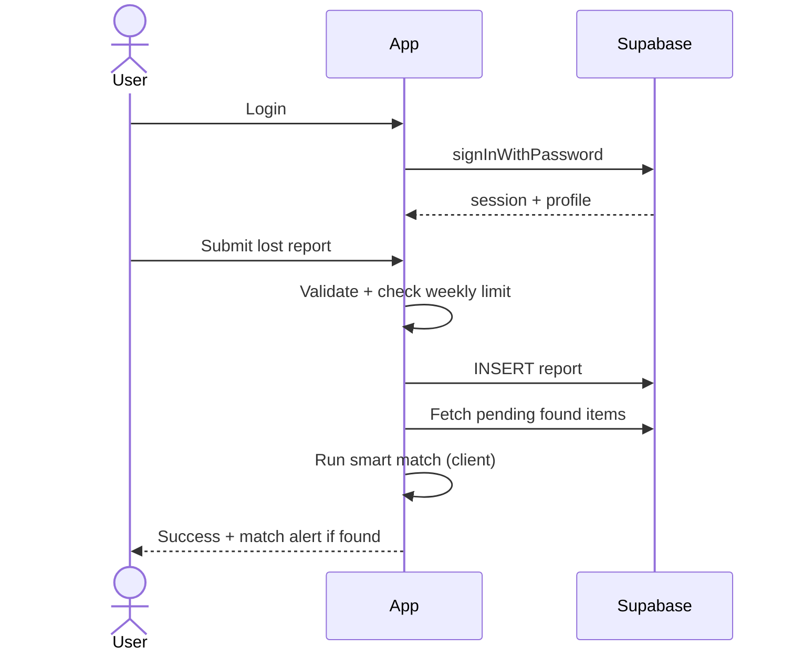
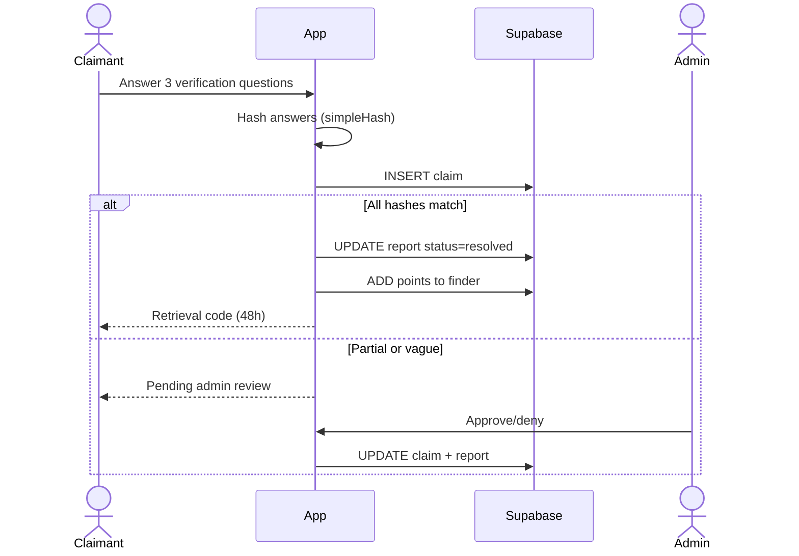
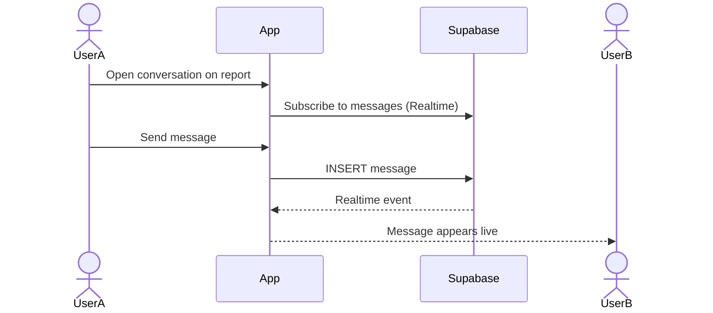

# Simplified Process — Streamlined Flows & Implementation Plan

This document simplifies **how users interact with LostFinder** and **how you should build the Supabase integration** in manageable phases.

## Current vs target user experience

| Scenario | Today (localStorage) | Target (Supabase) |
|----------|----------------------|-------------------|
| Student reports lost phone | Only visible on their browser | Visible to entire campus |
| Another student finds it | Cannot see the lost report | Sees listing + smart match on dashboard |
| Claim item | Works only if both used same browser | Cross-device claim with verification |
| Message finder | Manual refresh | Live chat |
| Page refresh | Logged out | Stays logged in |
| Admin review | Same browser only | Real admin from any device |

---

## Simplified user journeys

### Journey 1: Report a lost item



**Simplifications:**
- One form for both lost/found (already exists)
- Weekly limit enforced in DB trigger (backup to client check)
- No Base64 — image uploads directly to Storage

### Journey 2: Claim a found item



**Simplifications:**
- Three outcomes only: auto-approved, pending review, denied
- Enforce `expires_at` on retrieval codes (add column)
- Admin queue shows only `pending-review` claims

### Journey 3: Messaging



**Simplifications:**
- Drop `sender_name` denormalization later (join `profiles` instead)
- Mark `is_read` when opening chat
- One conversation per report + user pair (already implemented)

---

## Simplified development process

Instead of a big-bang rewrite, use **5 one-week phases**:

### Week 1 — Foundation

**Goal:** Supabase project live; auth works; app still looks the same.

| Task | Output |
|------|--------|
| Create Supabase project | URL + keys |
| Run SQL schema + RLS | Tables ready |
| Add `js/config.js`, `js/services/supabase.js` | Client connected |
| Migrate `register`, `login`, `logout` | Real auth |
| Session restore on load | No logout on refresh |
| Create admin user in dashboard | `role = 'admin'` |
| Remove `initializeAdminAccount` | No hardcoded passwords |

**Done when:** Two test accounts can register, login, and stay logged in after refresh.

### Week 2 — Reports

**Goal:** Lost/found listings shared across devices.

| Task | Output |
|------|--------|
| `reports.js` service | CRUD functions |
| Migrate `submitReport` | Creates DB rows |
| Migrate `loadLostItems`, `loadFoundItems`, `loadMyReports` | Lists from DB |
| Migrate `loadDashboard` | Stats from DB |
| Keep `findMatches` client-side | Fetch found items, score in JS |
| Setup Storage bucket | Ready for images |

**Done when:** Report on Browser A appears on Browser B.

### Week 3 — Images & claims

**Goal:** Photos work at scale; claim flow end-to-end.

| Task | Output |
|------|--------|
| `storage.js` + update `handleImageUpload` | File upload, not Base64 |
| Migrate `submitClaim` | Claims in DB |
| Add `expires_at` enforcement | Retrieval codes expire |
| Migrate admin claim review | Approve/deny works |

**Done when:** Full lost → found → claim → resolve flow works cross-device.

### Week 4 — Messages & admin

**Goal:** Realtime chat; admin tools on shared data.

| Task | Output |
|------|--------|
| Migrate messaging functions | Messages in DB |
| Add Realtime subscription | Live chat |
| Migrate admin panel, all items, resolve/delete | Admin on real data |
| Migrate leaderboard + settings | Profiles from DB |

**Done when:** Admin and users collaborate on same dataset with live messages.

### Week 5 — Hardening & cleanup

**Goal:** Production-ready polish.

| Task | Output |
|------|--------|
| HTML escaping on all renders | XSS fixed |
| Remove all `getData`/`saveData` | No localStorage |
| Add `icon/` assets or fix CSS paths | UI complete |
| Add `package.json` + `npm run dev` | Easy local run |
| Split `main.js` into modules (optional) | Maintainable codebase |
| Test RLS with non-admin account | Security verified |

**Done when:** Ready for campus pilot deployment.

---

## Simplified code change strategy

### The adapter pattern (lowest risk)

Do not rewrite every function at once. Insert one adapter:

```javascript
// js/services/data.js
import { USE_SUPABASE } from '../config.js';
import * as reportsApi from './reports.js';

export async function getReports(filters) {
  if (USE_SUPABASE) return reportsApi.fetchReports(filters);
  return getData('reports').filter(/* legacy filter */);
}
```

1. Add adapter functions
2. Change `getData('reports')` → `await getReports(...)` one screen at a time
3. When all screens migrated, delete localStorage branch

### Screen-by-screen order

1. Auth (login/register) — blocks everything else
2. Found items list — read-only, easy to test
3. Lost items list — read-only
4. Submit report — first write path
5. Dashboard — reads reports
6. My reports — user-scoped reads
7. Claims — writes + admin
8. Messages — writes + realtime
9. Admin — last (depends on all data)

---

## Simplified configuration

### One config file

```javascript
// js/config.js
export const SUPABASE_URL = 'https://xxxx.supabase.co';
export const SUPABASE_ANON_KEY = 'eyJ...';
export const WEEKLY_REPORT_LIMIT = 3;
export const USE_SUPABASE = true;
```

### One npm script

```json
{ "scripts": { "dev": "live-server --port=8080" } }
```

Matches existing `.vscode/launch.json`.

---

## Simplified data rules (single source of truth)

Move business rules to this matrix — implement in DB where possible:

| Rule | Where to enforce |
|------|------------------|
| Max 3 reports/week | DB trigger + client alert |
| Password ≥ 6 chars | Client + Supabase Auth settings |
| Unique username/email/ID | DB unique constraints |
| Only finder sets verify hashes | Client (found type only) + RLS insert |
| Claimant cannot see hashes | Never return `verify_hashes` to non-finder (RLS or view) |
| Admin-only delete | RLS |
| Points on report/resolve | Client v1; DB function v2 |
| Image max 5MB | Client validation before upload |

---

## Simplified deployment

### Option A: Static hosting (recommended for v1)

Host `index.html`, `main.css`, and `js/` on:

- **Vercel** / **Netlify** / **GitHub Pages**
- Set Supabase Auth → Site URL to your deployed domain

No server to maintain.

### Option B: Campus server

Serve static files from existing ICCT web server. Same Supabase backend.

### What you do NOT need

- Custom Node/Express API (Supabase replaces it)
- Docker
- Redis
- Separate auth server

---

## Simplified file ownership

| Concern | Owner file(s) |
|---------|---------------|
| Supabase connection | `js/services/supabase.js` |
| Login/register | `js/services/auth.js` |
| Reports CRUD | `js/services/reports.js` |
| Claims | `js/services/claims.js` |
| Messages + realtime | `js/services/messages.js` |
| Image upload | `js/services/storage.js` |
| Matching algorithm | `js/domain/matching.js` (unchanged logic) |
| Hash verification | `js/domain/verification.js` |
| UI rendering | `main.js` or `js/ui/*` (later) |

---

## Quick wins (do these first)

1. **Add missing `icon/` images** — fixes broken UI immediately
2. **Create Supabase project + schema** — 1–2 hours
3. **Swap auth only** — biggest security/UX win for least code change
4. **Stop storing Base64 images** — prevents localStorage crashes
5. **Remove admin password from console/alerts** — security hygiene

---

## Success metrics for campus pilot

| Metric | Target |
|--------|--------|
| Reports visible cross-device | 100% |
| Auth session survives refresh | Yes |
| Image upload success rate | >95% under 5MB |
| Claim auto-approval accuracy | Same as current hash logic |
| Message delivery latency | <2s with Realtime |
| Admin can moderate without DevTools | Yes |

---

## Related documents

- [01-system-overview.md](./01-system-overview.md) — what exists today
- [02-refactor-recommendations.md](./02-refactor-recommendations.md) — code structure changes
- [03-supabase-integration-plan.md](./03-supabase-integration-plan.md) — schema, RLS, Storage
- [04-migration-guide.md](./04-migration-guide.md) — function-by-function mapping
