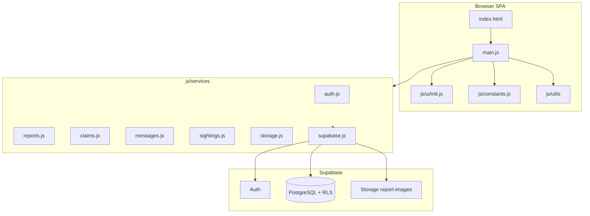
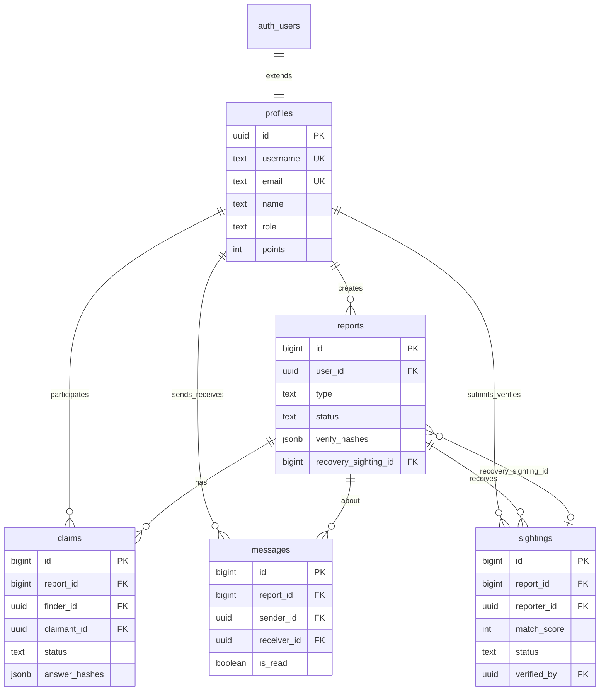

# System Design — LostFinder (Capcap)

> **Current architecture reference** (Supabase-backed). For setup, see [SETUP.md](./SETUP.md). For user flows, see [07-system-flows.md](./07-system-flows.md).

## Project goal

LostFinder is a campus lost-and-found web app for **ICCT Colleges Cainta**. It lets students and staff:

1. Report lost and found items (with optional photos)
2. Discover matches between lost and found listings
3. Claim found items via blind verification (hashed Q&A)
4. Submit and verify **sighting tips** on lost items
5. Message other users about specific items
6. Earn points and appear on a leaderboard
7. Admins review claims, manage items, and view campus stats

---

## High-level architecture



| Layer | Technology | Role |
|-------|------------|------|
| UI | HTML5 + CSS3 | Sections, modals, forms |
| App logic | Vanilla JS ES modules (`main.js`) | Routing, rendering, matching, orchestration |
| Data access | `js/services/*.js` | Supabase client wrappers |
| Backend | Supabase | Auth, PostgreSQL, Storage, RLS |
| Config | `.env` → `js/config.js` | URL, anon key, weekly limit |
| Dev server | live-server (port 8080) | Local development |

**Pattern:** `main.js` imports services, keeps domain logic (matching, hashing) inline, and exposes selected handlers on `window` for HTML `onclick` attributes.

**Not used:** Edge Functions, Realtime subscriptions, build bundler, server-side rendering.

---

## Repository structure

```
Capcap/
├── index.html              # All UI sections + modals
├── main.js                 # App logic (~2,200 lines)
├── main.css                # Styles
├── js/
│   ├── config.js           # Generated from .env (gitignored)
│   ├── config.example.js
│   ├── constants.js        # Categories, points, badges
│   ├── services/           # Supabase data layer
│   │   ├── supabase.js
│   │   ├── auth.js
│   │   ├── reports.js
│   │   ├── claims.js
│   │   ├── messages.js
│   │   ├── sightings.js
│   │   └── storage.js
│   ├── ui/init.js          # Category selects, loading states
│   └── utils/
│       ├── escape.js       # XSS protection
│       └── export.js       # Dashboard JSON/CSV download
├── scripts/generate-config.mjs
└── docs/
    ├── sql/                # Migrations 000–009
    └── *.md                  # Documentation
```

---

## Database design

### Entity-relationship diagram



### Tables

| Table | Purpose |
|-------|---------|
| `auth.users` | Supabase Auth credentials (managed by GoTrue) |
| `profiles` | Extended user profile, points, role (`user` / `admin`) |
| `reports` | Lost and found item listings |
| `claims` | Blind verification attempts on found items |
| `messages` | Per-item chat between two users |
| `sightings` | Community tips on lost items |

### Key columns

**reports**

- `type`: `lost` | `found`
- `status`: `pending` | `resolved`
- `verify_hashes`: JSON `{ q1, q2, q3 }` — hashes of finder's verification answers (found items only)
- `recovery_sighting_id`: optional FK to sighting credited for recovery (008)

**claims**

- `status`: `auto-approved` | `pending-review` | `approved` | `denied`
- `answer_hashes`: claimant's hashed answers
- `retrieval_code`: generated on approval (e.g. `LF-ABC123`)
- `expires_at`: 48h window for auto-approved claims

**sightings**

- `match_score` / `match_label`: client-computed relevance (0–100, high/possible/low)
- `status`: `pending` | `helpful` | `recovered` | `dismissed`
- `points_awarded`: cumulative points given to reporter

### Database functions and triggers

| Name | Source | Purpose |
|------|--------|---------|
| `handle_new_user()` | 001, 006 | Create `profiles` row on signup |
| `is_admin()` | 001 | RLS helper — checks `profiles.role = 'admin'` |
| `check_weekly_report_limit()` | 001 | Trigger: max 3 reports per user per 7 days |
| `get_login_email(text)` | 005 | RPC: username → email (pre-login) |
| `check_profile_available(...)` | 005 | RPC: duplicate username/email/id check |
| `ensure_user_profile()` | 006 | RPC: backfill profile if missing on login |

---

## Security model (RLS)

Row Level Security is enabled on all public tables. Summary:

| Table | Select | Insert | Update | Delete |
|-------|--------|--------|--------|--------|
| `profiles` | All authenticated | Trigger only | Own or admin | — |
| `reports` | All authenticated | Own | Own or admin | Admin |
| `claims` | Claimant, finder, admin | Own (claimant) | Admin | — |
| `messages` | Sender, receiver, admin | Own (sender) | Receiver (read) | — |
| `sightings` | Reporter, report owner, admin | Own (reporter) | Report owner | — |

**Storage** (`report-images` bucket, public read):

- `{userId}/{reportId}.ext` — report photos
- `sightings/{userId}/{key}.ext` — sighting photos

**RPCs** (`005`, `006`): run as `security definer` for pre-auth username lookup and profile backfill.

Full policy SQL: [002_rls.sql](./sql/002_rls.sql), [004_admin_messages.sql](./sql/004_admin_messages.sql), [007_sightings.sql](./sql/007_sightings.sql), [008_sighting_verification.sql](./sql/008_sighting_verification.sql), [009_fix_messages_rls.sql](./sql/009_fix_messages_rls.sql).

---

## SQL migrations

Run in Supabase SQL Editor in order (see [SETUP.md](./SETUP.md)):

| File | Purpose |
|------|---------|
| [000_reset_database.sql](./sql/000_reset_database.sql) | Optional — wipe all app data |
| [001_schema.sql](./sql/001_schema.sql) | Tables, triggers, core functions |
| [002_rls.sql](./sql/002_rls.sql) | RLS policies + grants |
| [003_storage.sql](./sql/003_storage.sql) | `report-images` bucket |
| [004_admin_messages.sql](./sql/004_admin_messages.sql) | Admin message read policy |
| [005_auth_rpc.sql](./sql/005_auth_rpc.sql) | Login/signup RPCs |
| [006_ensure_profile.sql](./sql/006_ensure_profile.sql) | Profile backfill on login |
| [007_sightings.sql](./sql/007_sightings.sql) | Sightings table + storage policy |
| [008_sighting_verification.sql](./sql/008_sighting_verification.sql) | Owner verification columns |
| [009_fix_messages_rls.sql](./sql/009_fix_messages_rls.sql) | Message send RLS fix |

---

## Points economy

Defined in [js/constants.js](../js/constants.js):

| Action | Points | Trigger |
|--------|--------|---------|
| Report lost item | +5 | `submitReport` |
| Report found item | +10 | `submitReport` |
| Item resolved (owner) | +20 | `submitLostRecovery`, `markResolved`, claim approval |
| Verified helpful sighting | +10 | `confirmSightingHelpful` |
| Sighting led to recovery | +25 | `confirmSightingRecovery` / `creditSightingRecovery` |

**Badge tiers:** Beginner (0+), Contributor (20+), Helper (50+), Hero (100+).

**Weekly limit:** 3 reports per user per 7 days (DB trigger + client check).

---

## Smart matching engine

Implemented in `main.js` (`calculateMatchScore`, `findMatches`, `scoreSightingTip`).

### Scoring weights

| Signal | Weight | Method |
|--------|--------|--------|
| Item name similarity | 40% | Levenshtein-based string similarity |
| Location overlap | 30% | Exact, substring, or fuzzy match |
| Keyword overlap | 30% | Token match with synonym expansion |

### Synonym dictionary

Covers campus items: wallet, phone, bag, laptop, glasses, keys, ID, etc. (`SYNONYMS` in `main.js`).

### Thresholds

| Score | Label | Used for |
|-------|-------|----------|
| ≥ 85% | High match | Smart match badge, sighting "strong lead" |
| 50–84% | Possible match | Dashboard suggestions, sighting "possible lead" |
| < 50% | Low / hidden | Found listing badge hidden; sighting still saved |

**Sightings:** User tip is scored against the lost report by treating the tip description + `location_seen` as a pseudo-found report (`scoreSightingTip`).

---

## Blind verification

Found-item reporters set 3 secret questions. Answers are hashed client-side (`simpleHash`) and stored in `reports.verify_hashes`. Claimants answer the same questions; hashes are compared in `submitClaim`.

| Outcome | Claim status | Report | Points |
|---------|--------------|--------|--------|
| All hashes match | `auto-approved` | Resolved | Finder +20 |
| Mismatch or vague (≤5 words) | `pending-review` | Pending | — |
| Admin approves | `approved` | Resolved | Finder +20 |

Plaintext answers are never stored or shown to the other party.

---

## UI sections (index.html)

| Section ID | Nav label | Loader |
|------------|-----------|--------|
| `#dashboard` | Dashboard | `loadDashboard` |
| `#lost` | Lost Items | `loadLostItems` |
| `#found` | Found Items | `loadFoundItems` |
| `#reports` | My Reports | `loadMyReports` |
| `#messages` | Messages | `loadConversations` |
| `#leaderboard` | Leaderboard | `loadLeaderboard` |
| `#settings` | Settings | `loadSettings` |
| `#admin-panel` | Admin Panel | `loadAdminPanel` (admin only) |
| `#all-items` | All Items | `loadAllItems` (admin only) |
| `#claims-panel` | Claims Review | `loadClaimsPanel` (admin only) |

Modals: `#reportModal`, `#claimModal`, `#sightingModal`, `#recoveryModal`.

---

## Related documentation

| Doc | Content |
|-----|---------|
| [07-system-flows.md](./07-system-flows.md) | Step-by-step user flows |
| [08-function-reference.md](./08-function-reference.md) | All functions |
| [09-recommendations.md](./09-recommendations.md) | Design gaps and improvements |
| [SETUP.md](./SETUP.md) | Environment and deployment setup |
