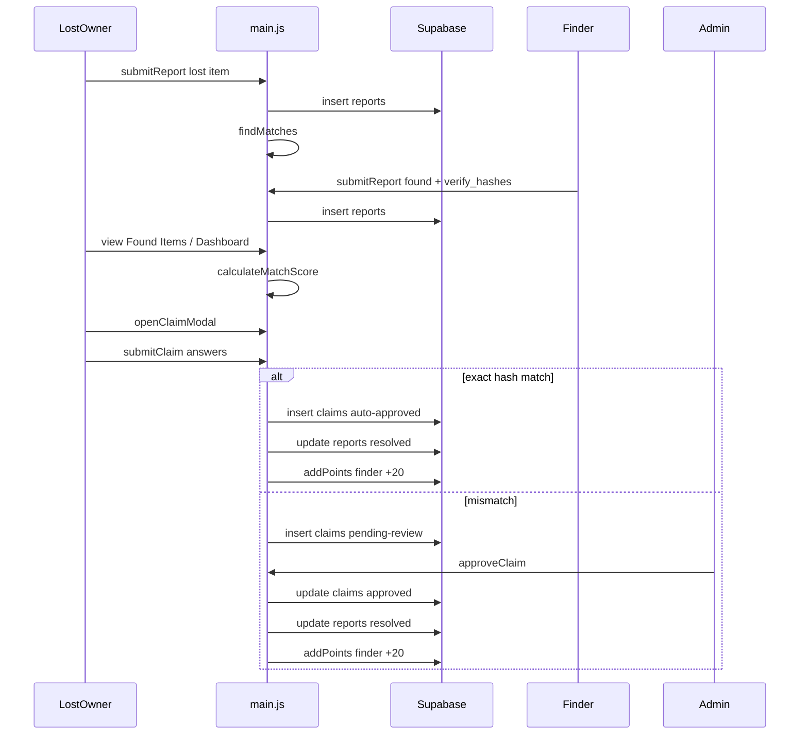
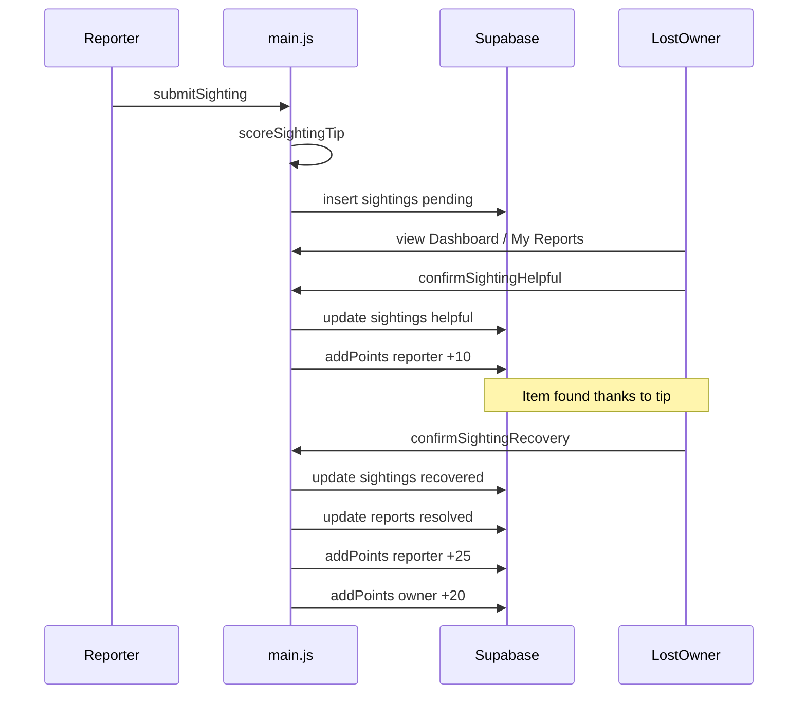
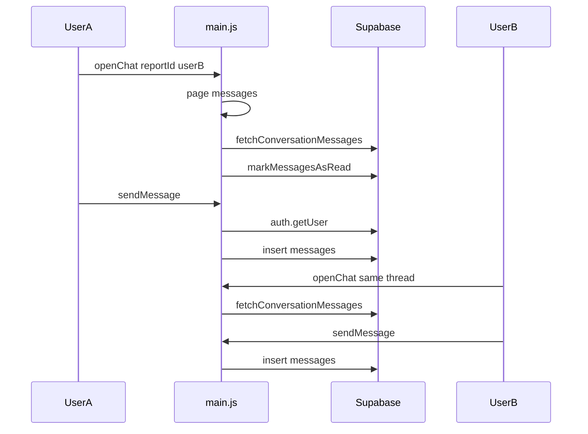

# System Flows — LostFinder (Capcap)

> Step-by-step flows for each major feature. Architecture: [06-system-design.md](./06-system-design.md). Function list: [08-function-reference.md](./08-function-reference.md).

Each flow lists: **actor**, **steps**, **tables touched**, **points**, and **UI entry points**.

---

## Navigation map

`page(id)` in `main.js` shows one `<section>` and calls the matching loader:

| `page()` id | HTML section | Loader |
|-------------|--------------|--------|
| `dashboard` | `#dashboard` | `loadDashboard` |
| `lost` | `#lost` | `loadLostItems` |
| `found` | `#found` | `loadFoundItems` |
| `reports` | `#reports` | `loadMyReports` |
| `messages` | `#messages` | `loadConversations` |
| `leaderboard` | `#leaderboard` | `loadLeaderboard` |
| `settings` | `#settings` | `loadSettings` |
| `admin-panel` | `#admin-panel` | `loadAdminPanel` |
| `all-items` | `#all-items` | `loadAllItems` |
| `claims-panel` | `#claims-panel` | `loadClaimsPanel` |

---

## 1. Register and login

**Actor:** Guest  
**Tables:** `auth.users`, `profiles`  
**Points:** —

### Register

1. User fills name, email, username, role, ID, contact, password on `#register`
2. Client validates fields; `checkProfileExists` RPC checks duplicates
3. `signUp` with metadata → Supabase Auth creates `auth.users`
4. Trigger `handle_new_user` inserts `profiles` row
5. `waitForProfile` polls; fallback `ensureProfile` RPC if needed
6. `enterApp` → sidebar + dashboard

### Login

1. User enters email **or** username + password on `#login`
2. If username: `getEmailByUsername` RPC resolves email
3. `signInWithPassword` → session stored by Supabase SDK
4. `waitForProfile` / `ensureProfile` ensures `profiles` row exists
5. `enterApp`

### Session restore

On `DOMContentLoaded`: `getSession` → if valid, `waitForProfile` → `enterApp`.

**UI:** Landing → Get Started → `#login` / `#register`  
**Functions:** `register`, `login`, `waitForProfile`, `ensureProfile`, `enterApp`

---

## 2. Report lost or found item

**Actor:** Authenticated user  
**Tables:** `reports`, Storage `report-images`, `profiles`  
**Points:** Lost +5, Found +10

1. User opens **My Reports** → **+ Report New Item** (`openReportModal`)
2. `getWeeklyReportCount` — blocked if ≥ 3 reports in 7 days (also enforced by DB trigger)
3. User selects type, category, name, location, date, description, optional photo
4. **Found only:** 3 verification Q&A → hashed into `verify_hashes` (`simpleHash`)
5. `createReport` inserts row
6. Optional: `uploadReportImage` → `updateReport` with `image_url`
7. `addPoints` for reporter
8. **Lost only:** `findMatches` scans pending found items; alert if top match ≥ 50%

**UI:** `#reportModal`, `#reports`  
**Functions:** `submitReport`, `toggleVerificationQuestions`, `handleImageUpload`

---

## 3. Browse lost and found listings

**Actor:** Any authenticated user  
**Tables:** `reports` (read)  
**Points:** —

### Lost Items (`#lost`)

1. `fetchReports({ type: 'lost', status: 'pending' })`
2. Search/filter by name, location, category
3. Non-owner actions: **Submit Sighting**, **Message Owner**

### Found Items (`#found`)

1. `fetchReports({ type: 'found', status: 'pending' })`
2. If user has pending lost items: `calculateMatchScore` badge on each card
3. Non-owner actions: **Claim** (if verify_hashes set), **Message**

**Functions:** `loadLostItems`, `loadFoundItems`, `filterLostItems`, `filterFoundItems`, `renderLostItems`, `renderFoundItems`

---

## 4. Smart match (dashboard)

**Actor:** User with pending lost items  
**Tables:** `reports`  
**Points:** —

1. `loadDashboard` fetches user's lost reports (pending)
2. For each lost report: `findMatches` compares against all pending found reports
3. Matches ≥ 50% shown on dashboard with **Claim This Item** button
4. Insights cached for JSON/CSV export

**UI:** `#dashboard` → `#dashboardMatches`  
**Functions:** `loadDashboard`, `findMatches`, `calculateMatchScore`

---

## 5. Blind claim (found item)

**Actor:** User who believes they lost the item  
**Tables:** `claims`, `reports`, `profiles`  
**Points:** Finder +20 on auto-approve or admin approve

1. User opens found item → **Claim** (`openClaimModal`)
2. Requires `verify_hashes` on report; else message to contact finder
3. User answers 3 verification questions
4. Answers hashed; compared to `verify_hashes` in `submitClaim`
5. **Exact match:** claim `auto-approved`, report `resolved`, retrieval code, finder +20 pts
6. **Mismatch / vague:** claim `pending-review` → admin **Claims Review**

**UI:** `#claimModal`  
**Functions:** `openClaimModal`, `submitClaim`, `simpleHash`

### Sequence: Lost report → match → claim → resolve

---

## 6. Admin claim review

**Actor:** Admin (`profiles.role = 'admin'`)  
**Tables:** `claims`, `reports`, `profiles`  
**Points:** Finder +20 on approve

1. **Claims Review** nav → `loadClaimsPanel`
2. Lists `pending-review` claims
3. **Approve:** status `approved`, retrieval code, report resolved, finder +20
4. **Deny:** status `denied`

**Functions:** `loadClaimsPanel`, `approveClaim`, `denyClaim`

---

## 7. Submit sighting tip

**Actor:** User who is **not** the lost item owner  
**Tables:** `sightings`, Storage, `reports`  
**Points:** — (until owner verifies)

1. **Lost Items** card → **Submit Sighting** (`openSightingModal`)
2. User enters location seen (optional), description (required), optional photo
3. `scoreSightingTip` computes live match preview
4. `createSighting` with `status: pending`, `match_score`, `match_label`
5. Optional: `uploadSightingImage`

**UI:** `#sightingModal`  
**Functions:** `openSightingModal`, `submitSighting`, `updateSightingMatchPreview`

---

## 8. Owner verifies sighting

**Actor:** Lost item owner  
**Tables:** `sightings`, `reports`, `profiles`  
**Points:** Reporter +10 helpful, +25 recovery; owner +20 on recovery

| Action | Sighting status | Report | Reporter pts | Owner pts |
|--------|-----------------|--------|--------------|-----------|
| Helpful | `helpful` | unchanged | +10 | — |
| Recovered via them | `recovered` | `resolved` | +25 | +20 |
| Dismiss | `dismissed` | unchanged | — | — |

**UI:** Dashboard tip cards, **My Reports** → lost item → sighting block  
**Functions:** `confirmSightingHelpful`, `confirmSightingRecovery`, `dismissSighting`, `creditSightingRecovery`

### Sequence: Sighting → owner review → recovery

---

## 9. Mark item recovered (owner)

**Actor:** Lost item owner  
**Tables:** `reports`, optionally `sightings`  
**Points:** Owner +20; reporter +25 if sighting credited

1. **My Reports** → pending lost item → **Mark Item Recovered** (`openRecoveryModal`)
2. Choose: found on own **or** credit a sighting reporter from dropdown
3. **Own:** `updateReport` resolved, owner +20
4. **Credit sighting:** `creditSightingRecovery` (same as confirm recovery)

**UI:** `#recoveryModal`  
**Functions:** `openRecoveryModal`, `submitLostRecovery`

---

## 10. Messaging

**Actor:** Any two users discussing an item  
**Tables:** `messages`, `profiles`  
**Points:** —

1. Entry: Lost/Found card **Message**, sighting **Reply**, dashboard tip **Reply**
2. `openChat` sets `report_id` + `other_user_id`, navigates to `#messages`
3. `loadConversations` lists threads by `(report_id, other_user_id)`
4. `loadMessages` fetches thread; `markMessagesAsRead` for receiver
5. `sendMessage` → `sendMessageToDb` uses `auth.getUser()` for `sender_id` (RLS)

**UI:** `#messages`, `#chatWindow`, `#messageInput`  
**Functions:** `openChat`, `loadConversations`, `loadMessages`, `sendMessage`

### Sequence: Message thread

---

## 11. Dashboard and export

**Actor:** Regular user or admin  
**Tables:** `reports`, `sightings`, `profiles`  
**Points:** —

### Regular user

1. Stats: my lost / found / resolved counts
2. Pending sighting tips (owner review)
3. Reviewed tips, submitted sightings, smart matches
4. **JSON / CSV** download (`downloadDashboardInsights`)

### Admin

1. Campus-wide pending lost / found / resolved counts
2. Full `platform_reports` in export payload

**Functions:** `loadDashboard`, `downloadDashboardInsights`, `setDashboardDownloadButtons`  
**Requires:** SQL 007/008 for sightings sections; graceful fallback via `safeFetchSightingsForOwner`

---

## 12. Leaderboard

**Actor:** Any user  
**Tables:** `profiles`, `reports` (count)  
**Points:** —

1. `fetchLeaderboardUsers` — non-admin users sorted by points
2. Badge from `getBadgeLabel`; report count per user

**UI:** `#leaderboard`  
**Functions:** `loadLeaderboard`

---

## 13. Settings

**Actor:** Authenticated user  
**Tables:** `profiles`  
**Points:** —

1. Editable: name, contact
2. Read-only: email, username, role
3. `updateProfile` on save

**UI:** `#settings`  
**Functions:** `loadSettings`, `saveSettings`

---

## 14. Admin operations

**Actor:** Admin only  
**Tables:** All  
**Points:** +20 on resolve

| Panel | Function | Actions |
|-------|----------|---------|
| Admin Panel | `loadAdminPanel` | Campus stats, top contributors |
| All Items | `loadAllItems` | Resolve pending reports, delete any report |
| Claims Review | `loadClaimsPanel` | Approve/deny pending claims |

Admin nav links injected in `updateSidebar` when `currentUser.role === 'admin'`.

---

## Flow summary table

| Flow | Key functions | Tables |
|------|---------------|--------|
| Register / Login | `register`, `login`, `waitForProfile` | `auth.users`, `profiles` |
| Report item | `submitReport` | `reports`, storage |
| Browse listings | `loadLostItems`, `loadFoundItems` | `reports` |
| Smart match | `findMatches`, `loadDashboard` | `reports` |
| Blind claim | `submitClaim` | `claims`, `reports` |
| Admin claims | `approveClaim`, `denyClaim` | `claims`, `reports`, `profiles` |
| Submit sighting | `submitSighting` | `sightings`, storage |
| Verify sighting | `confirmSightingHelpful`, `confirmSightingRecovery` | `sightings`, `reports`, `profiles` |
| Mark recovered | `submitLostRecovery` | `reports`, `sightings` |
| Messaging | `openChat`, `sendMessage` | `messages` |
| Dashboard export | `loadDashboard`, `downloadDashboardInsights` | all user tables |
| Admin panel | `loadAdminPanel`, `loadAllItems` | all tables |
