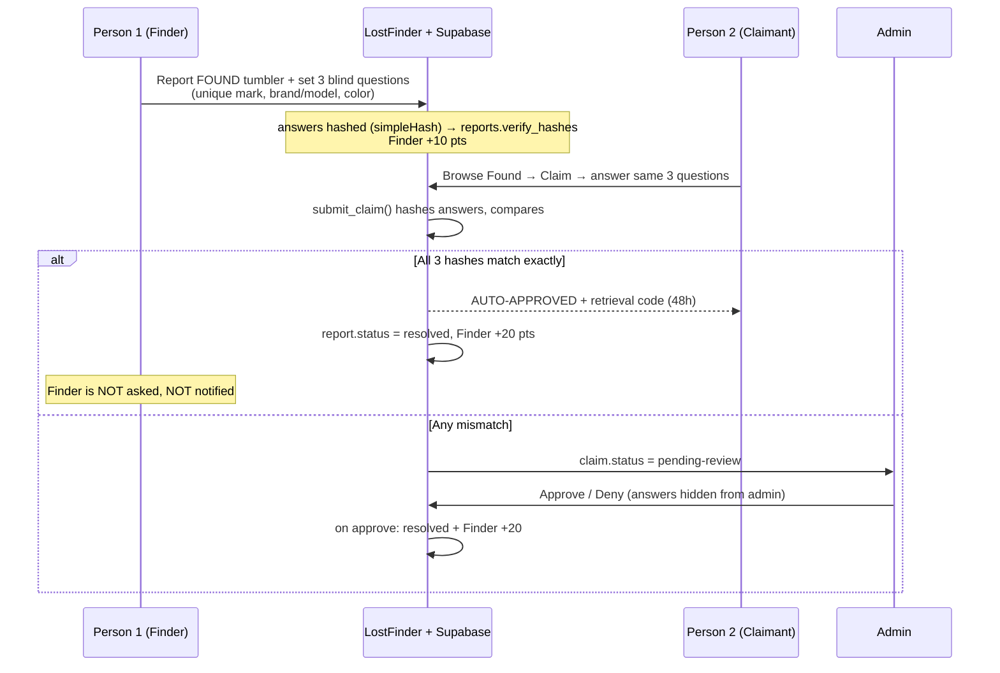
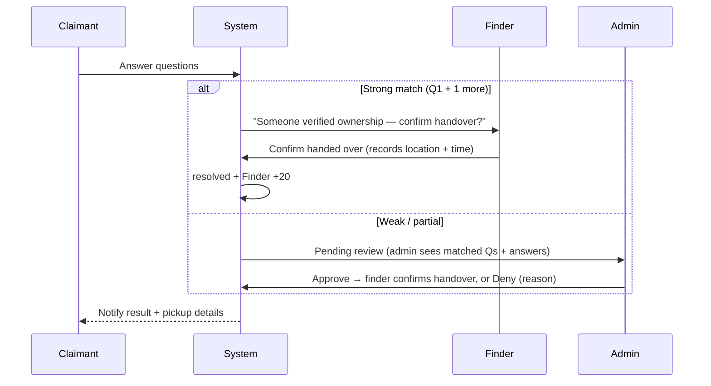

# Claim & Verification Flow — Feedback and Recommendations

> Grounded in the current code: `main.js` (`submitReport`, `openClaimModal`, `submitClaim`, `loadClaimsPanel`, `approveClaim`/`denyClaim`), `docs/sql/schema.sql` (`submit_claim`, `verify_claim_answers`, `resolve_report_for_claim`), and `index.html` (claim/verification modals).

---

## Worked example (your scenario)

**Person 1** finds a tumbler and reports it. **Person 2** claims it is theirs.

### What the code actually does today

### Direct answer: who approves that the item belongs to the owner?

| Path | Who decides | Information they have |
|------|-------------|-----------------------|
| **Exact answer match** | **Nobody** — automatic | A 3‑field hash comparison only |
| **Partial / mismatch** | **Admin** (`loadClaimsPanel`) | Only "hash match/mismatch" + "vague" flag — **answers are hidden** |
| **Finder (Person 1)** | **No role at all** | Not notified, cannot see or approve claims on their own item |

So the person who physically holds the tumbler (the finder) never confirms the handover, and for exact matches **no human ever reviews the claim**.

---

## Findings

### 1. The finder is cut out of the loop entirely
`renderFoundItems` shows a Claim button to everyone except the owner, but the finder is never told a claim happened and never confirms handing the item over. Compare this to the **sightings** flow, where the lost‑item owner explicitly verifies tips (`confirmSightingHelpful` / `confirmSightingRecovery`). Claims have no equivalent finder confirmation.

**Impact:** The item's physical custodian has no say in who receives it.

### 2. Auto‑approval trusts guessable answers
The default questions are **brand/model** and **color** (`index.html` lines 375–380). Those are usually visible in the listing's description and photo. Combined with `simpleHash` (case/whitespace‑normalized exact match over a tiny answer space like "blue", "Samsung"), a stranger can plausibly guess all three and **auto‑claim** an item.

**Impact:** Weak ownership proof; a non‑owner can pass verification.

### 3. The admin reviews "blind" with no usable information
`loadClaimsPanel` deliberately hides answer contents ("⚠️ Answer contents hidden per Blind Verification Protocol") and only shows *hash match / mismatch* and a *vague* flag. But the admin is the one expected to Approve/Deny partial claims — with essentially **no evidence** to judge.

**Impact:** Admin approval is effectively a rubber stamp.

### 4. No physical handover tracking
On success the claimant gets `LF‑XXXXXX` with "present this code to claim your item" — but the schema never records **where** to pick it up, **who** released it, or **when it was received**. The loop is closed in software (`status = resolved`) but not in reality.

**Impact:** No accountability for the actual exchange; disputes can't be reconstructed.

### 5. No notifications
Claim creation and status changes don't notify the finder, claimant, or admin. Realtime exists only for chat messages, not claims. Everyone must manually re‑open pages.

### 6. No claim throttling / race handling
Nothing limits repeated claim attempts on one item, and there's no guard against two near‑simultaneous claims before the report flips to `resolved`.

### 7. Points can reward a bad outcome
`+20` to the finder fires on *resolve* (auto or admin), regardless of whether the item truly reached its owner.

---

## Recommendations (prioritized)

### High — close the trust gap

| # | Recommendation | Why |
|---|----------------|-----|
| H1 | **Add a finder confirmation step.** Auto‑approval should mark the claim `verified-pending-handover`, then the **finder** confirms "handed over" (mirroring the sightings owner‑verify pattern). Only then `resolved` + points. | Puts the item's custodian back in control of the handover |
| H2 | **Give the admin real evidence.** For `pending-review`, show which of Q1/Q2/Q3 matched and the claimant's raw answers (admin‑only, RLS‑guarded). Keep them hidden from other users, not from the decision‑maker. | An approver needs information to approve |
| H3 | **Require at least one hard‑to‑guess question.** Make Q1 ("unique marking/feature") mandatory and exclude it from the listing's public description; treat brand/color as secondary. Consider requiring Q1 + one other to auto‑approve. | Defeats guess‑from‑photo claims |

### Medium — accountability & UX

| # | Recommendation | Why |
|---|----------------|-----|
| M1 | **Track handover.** Add `claims.pickup_location`, `released_by`, `received_at`, `finder_confirmed`. Record who released the item and when. | Real‑world auditability |
| M2 | **Notify on claim events.** Finder + admin on new claim; claimant on approve/deny. Reuse the Realtime channel pattern or add an in‑app badge. | No more manual refresh; faster returns |
| M3 | **Throttle claims.** Rate‑limit attempts per user per report (e.g. 3), and lock further claims once one is `verified`/`approved`. | Stops brute‑forcing the 3 answers |
| M4 | **Document the physical process.** Define the campus pickup point (e.g. SAO/guard desk) where the code is presented, and who validates it. | The code is meaningless without a defined desk |

### Low — polish

| # | Recommendation |
|---|----------------|
| L1 | Defer the finder's `+20` until handover is confirmed, not on auto‑approve. |
| L2 | Let the finder open a chat with the claimant directly from a "Claims on my items" view. |
| L3 | Add an admin dispute/override path for contested claims (deny + reason, re‑open report). |

---

## Suggested target flow

The core idea: **verification (does this person know the item?)** and **handover (did the custodian actually give it to them?)** are two separate gates. Today the app collapses both into one hash check. Splitting them — and looping in the finder — fixes the central "who actually approves this?" gap.

---

## Where each change lives

| Change | Code touch points |
|--------|-------------------|
| Finder confirmation | `submit_claim` (return `verified-pending-handover`), new `confirm_claim_handover` RPC, new "Claims on my found items" UI in `main.js` |
| Admin sees answers | `loadClaimsPanel` rendering + RLS allowing admin/finder to read `answer_hashes`/answers |
| Handover fields | `claims` table columns in `docs/sql/schema.sql` |
| Notifications | extend Realtime (`js/services/messages.js` pattern) to `claims` |
| Throttle | check in `submit_claim` (count existing claims per user/report) |

See also: [06-system-design.md](./06-system-design.md), [07-system-flows.md](./07-system-flows.md), [09-recommendations.md](./09-recommendations.md).
