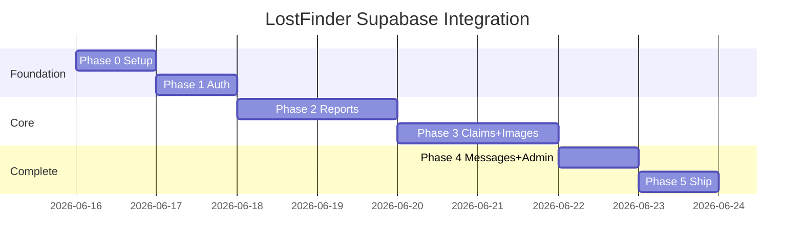

# Development Phases — Fast Prototype with Supabase

A **5-phase plan** to get LostFinder working on Supabase quickly. Each phase is shippable — you can demo after every phase.

> **Status: All phases (0–5) implemented in code.** See [SETUP.md](./SETUP.md) to configure Supabase and run.

**Prototype rules (keep scope small):**
- Keep existing HTML/CSS/UI — no redesign
- Keep `main.js` for now — add thin `js/services/` layer only
- Skip Realtime (refresh messages manually)
- Skip Edge Functions
- Skip full module split until Phase 5
- Images in Phase 3 (reports work without photos in Phase 2)

**Estimated total time:** 1–2 weeks (one developer, focused)

---

## Phase 0 — Project Setup
**Time:** 2–4 hours | **Blocks:** everything

### Goal
Supabase project exists, schema is live, local dev runs.

### Tasks

- [ ] **0.1** Create Supabase project at [supabase.com](https://supabase.com)
- [ ] **0.2** Run `docs/sql/001_schema.sql` in Supabase SQL Editor
- [ ] **0.3** Run `docs/sql/002_rls.sql` in Supabase SQL Editor
- [ ] **0.4** Create Storage bucket `report-images` (public read) — can wait until Phase 3
- [ ] **0.5** Create admin user in Supabase Auth dashboard, then set `profiles.role = 'admin'` in Table Editor
- [ ] **0.6** Add project files:
  ```
  js/config.js
  js/services/supabase.js
  ```
- [ ] **0.7** Add `package.json` with `npm run dev` (live-server port 8080)
- [ ] **0.8** Set Supabase Auth → URL Configuration → Site URL to `http://localhost:8080`

### Files to create

| File | Purpose |
|------|---------|
| `js/config.js` | `SUPABASE_URL`, `SUPABASE_ANON_KEY` |
| `js/services/supabase.js` | `createClient` singleton |
| `package.json` | `dev` script |
| `docs/sql/001_schema.sql` | Tables + triggers |
| `docs/sql/002_rls.sql` | Security policies |

### Done when
- [ ] `npm run dev` opens app at `http://localhost:8080`
- [ ] Browser console: `supabase` client connects without error
- [ ] `profiles` table exists in Supabase dashboard
- [ ] Admin account exists with `role = 'admin'`

### Do NOT do yet
- Touch `register()` / `login()` in `main.js`
- Remove `localStorage` code

---

## Phase 1 — Authentication
**Time:** 4–6 hours | **Depends on:** Phase 0

### Goal
Real login that persists across refresh. No more `btoa` passwords or hardcoded admin.

### Tasks

- [ ] **1.1** Create `js/services/auth.js` (`signUp`, `signIn`, `signOut`, `getSession`, `getProfile`)
- [ ] **1.2** Load Supabase in `index.html` (ES module or CDN)
- [ ] **1.3** Replace `register()` → `supabase.auth.signUp()` + profile metadata
- [ ] **1.4** Replace `login()` → `supabase.auth.signInWithPassword()`
- [ ] **1.5** Replace `logout()` → `supabase.auth.signOut()`
- [ ] **1.6** On `DOMContentLoaded`: restore session → skip landing if logged in
- [ ] **1.7** Delete `initializeAdminAccount()` entirely
- [ ] **1.8** Remove admin password from alerts and `console.log`
- [ ] **1.9** Map `currentUser` from `profiles` row (uuid `id`, not `Date.now()`)

### `currentUser` shape after Phase 1

```javascript
{
  id: 'uuid',           // was number
  username: '...',
  email: '...',
  name: '...',
  id_number: '...',
  contact_number: '...',
  role_label: 'Student',
  role: 'user' | 'admin',
  points: 0
}
```

### Login UX (prototype)
- Registration and login use **email + password** (simplest Supabase path)
- Update login placeholder: `"Email"` instead of `"Username or Email"`
- Optional later: username lookup → email resolution

### Done when
- [ ] New user can register and login
- [ ] Refresh keeps user logged in
- [ ] Admin can login with dashboard-created credentials
- [ ] `localStorage` `users` key is no longer written to
- [ ] No `admin/admin123` in code or console

### Test checklist
```
□ Register student@test.com → success
□ Login → dashboard loads
□ F5 refresh → still on dashboard
□ Logout → back to landing
□ Login as admin → admin sidebar links appear
```

---

## Phase 2 — Reports (core feature)
**Time:** 6–8 hours | **Depends on:** Phase 1

### Goal
Lost and found listings are **shared across all browsers**. This is the main value of Supabase.

### Tasks

- [ ] **2.1** Create `js/services/reports.js`:
  - `fetchReports({ type, status, userId })`
  - `createReport(report)`
  - `updateReport(id, updates)`
  - `getWeeklyReportCount(userId)`
- [ ] **2.2** Replace `submitReport()` — insert to Supabase (no image yet, `image_url: ''`)
- [ ] **2.3** Replace `loadLostItems()` / `loadFoundItems()` — fetch from Supabase
- [ ] **2.4** Replace `loadMyReports()` — filter by `user_id`
- [ ] **2.5** Replace `loadDashboard()` — stats from Supabase
- [ ] **2.6** Update field names in render functions:

  | Old (localStorage) | New (Supabase) |
  |--------------------|----------------|
  | `r.userId` | `r.user_id` |
  | `r.userName` | `r.user_name` |
  | `currentUser.id` | uuid string |

- [ ] **2.7** Keep `findMatches()` — fetch found reports, run same client-side algorithm
- [ ] **2.8** Update points: `supabase.from('profiles').update({ points })` after report
- [ ] **2.9** Weekly limit: keep client check via `getWeeklyReportCount()` (DB trigger already in schema as backup)

### Done when
- [ ] Submit lost item on Browser A → visible on Browser B
- [ ] Smart match alert still fires after lost report
- [ ] My Reports shows only current user's items
- [ ] Dashboard counts are correct
- [ ] `localStorage` `reports` key is no longer written to

### Test checklist
```
□ Browser A: login as user1, report lost "Blue Wallet"
□ Browser B: login as user2, see "Blue Wallet" in Lost Items
□ Browser B: report found "Blue Wallet" at same location
□ Browser A: dashboard shows match suggestion
□ User1 weekly limit blocks 4th report in 7 days
```

### Defer to Phase 3
- Image upload
- Claims on found items (works in UI but needs Phase 3 for persistence)

---

## Phase 3 — Claims + Images
**Time:** 6–8 hours | **Depends on:** Phase 2

### Goal
Full lost → found → claim → resolve loop works. Photos stored in Supabase Storage.

### Tasks

- [ ] **3.1** Create Storage bucket `report-images` + upload policy (if not done in Phase 0)
- [ ] **3.2** Create `js/services/storage.js` — `uploadReportImage(userId, reportId, file)`
- [ ] **3.3** Change `handleImageUpload` — store `File` object, preview with `URL.createObjectURL`
- [ ] **3.4** Update `submitReport()` — upload image after insert, save URL to `image_url`
- [ ] **3.5** Create `js/services/claims.js`:
  - `createClaim(claim)`
  - `fetchClaims({ status })`
  - `updateClaim(id, updates)`
- [ ] **3.6** Replace `submitClaim()` — insert claim, auto-approve or pending-review
- [ ] **3.7** On auto-approve: update report `status = 'resolved'`, add 20 points to finder
- [ ] **3.8** Replace admin claim review (`approveClaimAdmin`, `denyClaimAdmin`)
- [ ] **3.9** Add `expires_at` on auto-approved claims (48 hours)

### Done when
- [ ] Report with photo shows image from Storage URL
- [ ] Claimant answers 3 questions → auto-approve or pending review
- [ ] Auto-approved claim shows retrieval code
- [ ] Admin can approve/deny pending claims
- [ ] Resolved reports disappear from pending lists
- [ ] `localStorage` `claims` key is no longer written to

### Test checklist
```
□ Submit found item with photo → image displays
□ Wrong claim answers → pending-review status
□ Correct claim answers → auto-approved + retrieval code
□ Admin sees pending claim → approve → report resolved
□ Finder gets +20 points on resolution
```

---

## Phase 4 — Messages + Admin + Leaderboard
**Time:** 4–6 hours | **Depends on:** Phase 3

### Goal
Users can message each other. Admin tools and leaderboard use live data.

### Tasks

- [ ] **4.1** Create `js/services/messages.js`:
  - `fetchMessages(reportId, userId, otherUserId)`
  - `sendMessage(msg)`
  - `fetchConversations(userId)`
- [ ] **4.2** Replace `sendMessage()` / `sendNewMessage()`
- [ ] **4.3** Replace `loadConversations()` / `loadMessages()`
- [ ] **4.4** Mark messages read on `loadMessages()` (update `is_read = true`)
- [ ] **4.5** Replace `loadLeaderboard()` — `profiles` ordered by `points`
- [ ] **4.6** Replace `saveSettings()` — `profiles` update
- [ ] **4.7** Replace admin functions:
  - `loadAdminPanel()`
  - `loadAllItems()`
  - `resolveReportAdmin()` / `deleteReportAdmin()`
  - `loadClaimsPanel()`
- [ ] **4.8** Skip Realtime for prototype — user clicks Messages or sends to refresh

### Done when
- [ ] User A messages User B about a report → B sees it in Messages
- [ ] Leaderboard shows real points from Supabase
- [ ] Settings save persists after refresh
- [ ] Admin panel shows campus-wide stats
- [ ] Admin can resolve/delete any report
- [ ] `localStorage` `messages` key is no longer written to

### Test checklist
```
□ Send message about a report → appears in recipient's inbox
□ Leaderboard ranks users by points
□ Edit name in Settings → persists after refresh
□ Admin: view all items, resolve, delete
□ Admin: claims panel shows pending reviews
```

---

## Phase 5 — Cleanup & Ship
**Time:** 3–4 hours | **Depends on:** Phase 4

### Goal
Remove legacy code, fix broken UI, ready for campus demo.

### Tasks

- [ ] **5.1** Delete `getData()` and `saveData()` from `main.js`
- [ ] **5.2** Remove all `btoa` / password references
- [ ] **5.3** Add `escapeHtml()` for user content in `innerHTML` (basic XSS fix)
- [ ] **5.4** Add missing `icon/` images OR update `main.css` to use placeholder/colors
- [ ] **5.5** Disable Supabase email confirmation for demo (Auth → Providers → Email)
- [ ] **5.6** Deploy static files to Vercel/Netlify/GitHub Pages
- [ ] **5.7** Set production Site URL in Supabase Auth settings
- [ ] **5.8** Smoke test full flow on deployed URL

### Done when
- [ ] Zero `localStorage` usage for app data
- [ ] App works on deployed HTTPS URL
- [ ] Full demo flow completes in under 5 minutes
- [ ] No credentials in source code

### Demo script (5 min)
```
1. Register new student account
2. Report lost item
3. (Second browser) Report matching found item with photo
4. (First browser) See match on dashboard
5. Submit claim with correct answers → retrieval code
6. Send message to finder
7. (Admin) Review stats, resolve any pending items
8. Check leaderboard
```

---

## Phase summary

| Phase | Focus | Hours | Status |
|-------|--------|-------|--------|
| **0** | Supabase + dev environment | 2–4 | ✅ Done |
| **1** | Auth (login persists) | 4–6 | ✅ Done |
| **2** | Shared reports | 6–8 | ✅ Done |
| **3** | Claims + photos | 6–8 | ✅ Done |
| **4** | Messages + admin | 4–6 | ✅ Done |
| **5** | Cleanup + deploy | 3–4 | ✅ Done |



---

## What we intentionally skip (prototype)

| Feature | Why skip | Add later when |
|---------|----------|----------------|
| Realtime messaging | Manual refresh is fine for demo | Users complain about refresh |
| Edge Functions | Client-side hash/compare works | Need server-side secrecy |
| Module split (`js/ui/*`) | `main.js` works, faster to ship | Code becomes hard to maintain |
| Username-only login | Email login is simpler | UX feedback requests it |
| Email notifications | Not needed for campus pilot | Production launch |
| Retrieval code expiry enforcement | UI shows code; expiry is nice-to-have | Security review |
| Data migration from localStorage | Fresh start for pilot | Existing demo data needed |

---

## How to start development now

**Start with Phase 0, task 0.1.**

```bash
cd c:\Users\richa\Desktop\Capcap
npm install
npm run dev
```

Then run the SQL files in Supabase, fill in `js/config.js`, and move to Phase 1.

### Branch strategy (optional)

```
main
└── feature/phase-1-auth
└── feature/phase-2-reports
└── feature/phase-3-claims
└── feature/phase-4-messages
└── feature/phase-5-ship
```

One branch per phase keeps reviews small.

---

## Related docs

| Doc | When to read |
|-----|--------------|
| [03-supabase-integration-plan.md](./03-supabase-integration-plan.md) | Schema details, field mapping |
| [04-migration-guide.md](./04-migration-guide.md) | Per-function code changes |
| [02-refactor-recommendations.md](./02-refactor-recommendations.md) | After Phase 5, if maintaining long-term |

**This file (`DEVELOPMENT-PHASES.md`) is the primary guide for day-to-day development.**
